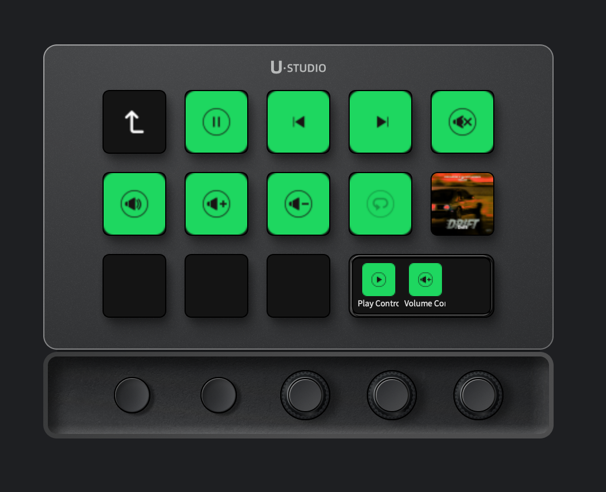

# Spotify Plugin for UlanziDeck — AppleScript Edition

Control Spotify directly from your Ulanzi device, with no API keys, no OAuth, and no running servers required.



---

## Background & Credits

This plugin is a fork of the original **[Spotify plugin by Ulanzi](https://www.ulanzi.com)**, rebuilt from the ground up to work around Spotify's increasingly restrictive Web API policies.

The original plugin relied on the **Spotify Web API**, which now requires app review, OAuth tokens, and a running local server to handle authentication callbacks. For most personal setups this became impractical to maintain.

This version replaces all API calls with **macOS AppleScript**, talking directly to the Spotify desktop app on your Mac — no tokens, no servers, no internet requests (except to fetch album artwork from Spotify's CDN).

> **This plugin only works on macOS.** AppleScript is a macOS-only technology. Windows and Linux are not supported.

---

## Requirements

- **macOS** 10.11 or later
- **Spotify desktop app** installed and running (the Mac app, not the browser)
- **UlanziDeck** 2.1.0 or later
- An Ulanzi device connected to your Mac

---

## Installation

1. Download or clone this repository
2. Navigate to your UlanziDeck plugins directory:
   ```
   ~/Library/Application Support/Ulanzi/UlanziDeck/Plugins/
   ```
3. Create a new folder inside `Plugins` named **exactly**:
   ```
   com.ulanzi.spotify.ulanziPlugin
   ```
4. Copy all the files from this repository into that folder. Your structure should look like:
   ```
   Plugins/
   └── com.ulanzi.spotify.ulanziPlugin/
       ├── app/
       │   └── index.js
       ├── assets/
       ├── property-inspectors/
       ├── manifest.json
       └── ...
   ```
5. Restart UlanziDeck
6. Open Spotify on your Mac
7. Drag any Spotify action onto a button in UlanziDeck — it will start working immediately

> No login, no setup wizard, no configuration required.

---

## Available Actions

### Buttons

| Action | Description |
|--------|-------------|
| **Play/Pause** | Toggles playback. Icon updates automatically to reflect current state. |
| **Previous Track** | Skips to the previous track |
| **Next Track** | Skips to the next track |
| **Toggle Shuffle** | Turns shuffle on or off. Icon reflects current shuffle state. |
| **Toggle Repeat** | Toggles repeat on or off. Icon reflects current repeat state. |
| **Toggle Volume Mute** | Mutes or restores volume. Remembers the previous volume level. |
| **Volume Up** | Increases volume by 10% |
| **Volume Down** | Decreases volume by 10% |
| **Volume Set** | Sets volume to a specific value (configure in settings) |
| **Now Playing** | Displays the current track's album art. Song name and artist alternate every 2 seconds. |

### Dial / Encoder Actions

| Action | Description |
|--------|-------------|
| **Play Control** | Press to play/pause. Rotate right for next track, left for previous. |
| **Volume Control** | Press to mute/unmute. Rotate to adjust volume. |
| **Seek Control** | Press to restart the track from the beginning. Rotate right to seek forward, left to seek back. Step size is configurable in settings (default 15 seconds). |

---

## How It Works

When you press a button, UlanziDeck sends a message to the plugin over a local WebSocket connection. The plugin then runs an AppleScript command like:

```applescript
tell application "Spotify" to playpause
tell application "Spotify" to next track
tell application "Spotify" to set sound volume to 80
```

Button states (play/pause icon, shuffle on/off, etc.) are kept in sync by polling Spotify every 3 seconds.

Album artwork is fetched from Spotify's image CDN using the URL exposed by AppleScript (`artwork url of current track`), downloaded once, and cached until the track changes.

---

## Limitations

Because this plugin uses AppleScript instead of the Spotify Web API, a few things are not possible:

- **No track liking** — Spotify's AppleScript dictionary does not expose a like/save command
- **Repeat mode** — AppleScript only supports on/off (no track vs. context distinction)
- **No playlist browsing** — Listing or navigating playlists is not available via AppleScript. You can still play a specific playlist by entering its Spotify URI in the My Playlists settings.
- **Spotify must be open** — The plugin controls the desktop app directly. If Spotify is closed, buttons will silently do nothing until Spotify is launched.

---

## Troubleshooting

**Buttons do nothing**
- Make sure the Spotify desktop app is open on your Mac (not just the browser)
- Try restarting UlanziDeck

**Button icons don't update**
- Icons sync every 3 seconds. Wait a moment after pressing a button.
- If they never update, restart UlanziDeck — the plugin may have lost its WebSocket connection

**Album art not showing on Now Playing button**
- Confirm Spotify is playing a track (not paused before ever playing)
- The artwork is fetched from Spotify's CDN — make sure your Mac has internet access

**macOS asks for permission**
- If macOS shows a prompt asking if UlanziDeck can control Spotify, click **Allow**. This is the Automation permission required for AppleScript to work. You can manage it in System Settings → Privacy & Security → Automation.

---

## What Changed from the Original Ulanzi Plugin

### Removed

| Feature | Reason |
|---------|--------|
| **Spotify Web API** | Replaced entirely with AppleScript — no tokens or OAuth needed |
| **OAuth login flow** | No longer required |
| **Local HTTP server** | Was needed for OAuth callback — no longer needed |
| **Device selector** | The API allowed choosing a Spotify Connect device (speaker, phone, etc.). AppleScript always controls the local Mac app, so this setting was removed from all buttons. |
| **Toggle Track Like** | Spotify's AppleScript dictionary has no like/save command. Removed rather than leave a broken button. |
| **My Playlists (dial)** | Required the API to list your playlists. Removed. |
| **New Releases (dial)** | Required the API to fetch new releases. Removed. |
| **Account selector** | No accounts or login — removed from all property inspector panels. |

### Added

| Feature | Description |
|---------|-------------|
| **Now Playing button** | Shows the current track's album art on the button. Song name and artist alternate as text every 2 seconds, overlaid on the art with a gradient and drop shadow. |
| **Seek Control dial** | New encoder action — rotate to seek forward or back by a configurable number of seconds (default 15s). Press to restart the track from the beginning. |
| **Instant state feedback** | Pressing play/pause, shuffle, or repeat now immediately updates the button icon — no waiting for the next poll cycle. |
| **Zero-dependency WebSocket client** | The original plugin bundled the `ws` npm package (89KB minified). This version implements the WebSocket protocol from scratch using only Node.js built-ins, so there is no `node_modules` folder needed. |

---

## License

Based on the original Spotify plugin © Ulanzi. This fork is provided as-is for personal use.
